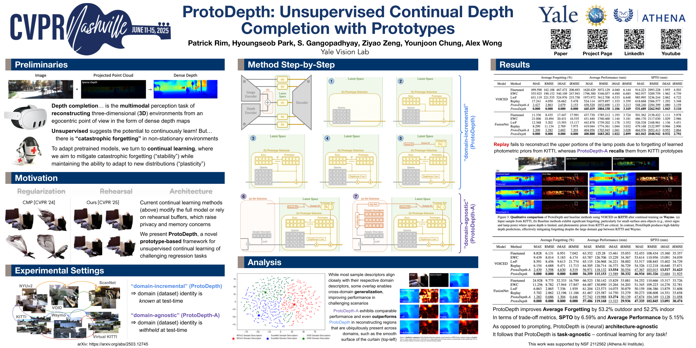

# [CVPR 2025] ProtoDepth: Unsupervised Continual Depth Completion with Prototypes

PyTorch implementation of *ProtoDepth: Unsupervised Continual Depth Completion with Prototypes*

Authors: [Patrick Rim](https://patrickqrim.github.io/), [Hyoungseob Park](https://www.linkedin.com/in/hyoungseob-park-00692a188/), [S. Gangopadhyay](https://www.linkedin.com/in/suchisrit/), [Ziyao Zeng](https://adonis-galaxy.github.io/homepage/), [Younjoon Chung](https://fuzzythecat.github.io/), [Alex Wong](https://www.cs.yale.edu/homes/wong-alex/)

[[Paper]](https://arxiv.org/abs/2503.12745) [[Project Page]](https://protodepth.github.io/)

<p align="center">
  
  
  
</p>
<p align="center">
  <em>Left: NYUv2 Scene | Middle: CMP [CVPR '24] | Right: Ours [CVPR '25]</em>
</p>
<p align="center">
  Demonstrating robust continual depth completion: performance over the course of training in the challenging mixed setting of adapting from indoor to outdoor environments.
</p>

## Table of Contents
1. [About ProtoDepth](#about-protodepth)
2. [Poster](#poster)
3. [Setting up your virtual environment](#setting-up-your-virtual-environment)
4. [Data Structure](#data-structure)
5. [Training ProtoDepth](#training-protodepth)
6. [Evaluation](#evaluation)
7. [Related Models](#related-models)
8. [Citation](#citation)
9. [Related Projects](#related-projects)
10. [License and Disclaimer](#license-and-disclaimer)

## About ProtoDepth

### Motivation

Existing depth completion methods assume access to all training data at once and cannot adapt to new environments encountered during deployment. In continual learning settings, where models must sequentially learn from different domains (e.g., adapting from indoor to outdoor scenes), standard approaches suffer from catastrophic forgetting—losing performance on previously seen domains when learning new ones.

Current solutions for this problem of *continual learning* either:
- Require storing all past data (violating privacy and memory constraints)
- Use domain-specific modules (linearly increasing model complexity)
- Employ knowledge distillation (requiring access to old models or data)

None of these approaches are suitable for practical deployment where models must continuously adapt to new environments without forgetting previous knowledge.

### Our Solution

We introduce **ProtoDepth**, a continual depth completion framework that learns domain-invariant representations through **prototypes** (learnable vector sets) that capture characteristic features of each domain. Our key innovations include:

#### 1. Token-Based Continual Learning
- **Learnable Prototypes**: Lightweight, learnable prototype sets for each domain that capture domain-specific depth completion patterns and modulate latent features *in-place*
- **Attention Mechanism**: Query-key-prototype attention to select and apply appropriate prototypes based on input features
- **Frozen Backbone**: Keep the base depth completion network frozen to prevent catastrophic forgetting

#### 2. Domain-Agnostic Selector
- **Automatic Domain Detection**: A selector network that learns domain descriptors to identify the appropriate domain without requiring manual labels during inference
- **Cross-Domain Regularization**: Encourages domain descriptors from different domains to remain distinct while maintaining consistency

Our approach achieves state-of-the-art performance on continual depth completion benchmarks while using significantly fewer learnable parameters than existing methods.

## Poster

<p align="center">
  
</p>

## Setting up your virtual environment

We will create a virtual environment with dependencies for running ProtoDepth.

```bash
virtualenv -p /usr/bin/python3.8 ~/venvs/protodepth
source ~/venvs/protodepth/bin/activate
```

### For NVIDIA RTX architectures (20, 30, 40 series with CUDA 11.1):
```bash
pip install torch==1.10.1+cu111 torchvision==0.11.1+cu111 -f https://download.pytorch.org/whl/torch_stable.html
pip install -r requirements.txt
```

### For other CUDA versions:
```bash
pip install torch torchvision
pip install -r requirements.txt
```

## Data Structure

ProtoDepth expects data to be organized in the `data/` directory with the following structure:

```
data/
├── kitti/
│   ├── raw_data/                      # KITTI raw data
│   │   ├── 2011_09_26/
│   │   ├── 2011_09_28/
│   │   └── ...
│   └── depth_completion/              # KITTI depth completion
│       ├── train/
│       ├── val/
│       └── test/
├── void/
│   ├── void_150/
│   ├── void_500/
│   └── void_1500/
├── nuscenes/
│   ├── samples/
│   ├── sweeps/
│   └── ...
└── nyu_v2/
    ├── images/
    └── depths/
```

### Training/Validation/Testing Splits

The model expects `.txt` files containing paths to training, validation, and testing data:

```
training/
├── kitti/
│   ├── train_image.txt
│   ├── train_sparse_depth.txt
│   ├── train_ground_truth.txt
│   └── train_intrinsics.txt
├── void/
│   └── ...
└── nuscenes/
    └── ...

validation/
├── kitti/
│   ├── val_image.txt
│   └── ...
└── ...

testing/
├── kitti/
│   ├── test_image.txt
│   └── ...
└── ...
```

Each `.txt` file should contain one absolute or relative path per line, e.g.:
```
data/kitti/raw_data/2011_09_26/2011_09_26_drive_0001_sync/image_02/data/0000000000.png
data/kitti/raw_data/2011_09_26/2011_09_26_drive_0001_sync/image_02/data/0000000001.png
...
```

**Note**: For dataset setup scripts and instructions on downloading KITTI, VOID, nuScenes, and NYU-v2 datasets, please refer to the `setup/` directory.

## Training ProtoDepth

ProtoDepth training consists of the following stages:

### Stage 1: Train on Source Domain (Domain-Incremental)
Train the model on the first domain (e.g., KITTI outdoor):

```bash
python depth_completion/src/train_depth_completion.py \
  --train_image_paths training/kitti/train_image.txt \
  --train_sparse_depth_paths training/kitti/train_sparse_depth.txt \
  --train_intrinsics_paths training/kitti/train_intrinsics.txt \
  --train_ground_truth_paths training/kitti/train_ground_truth.txt \
  --train_dataset_uids kitti \
  --val_image_paths validation/kitti/val_image.txt \
  --val_sparse_depth_paths validation/kitti/val_sparse_depth.txt \
  --val_intrinsics_paths validation/kitti/val_intrinsics.txt \
  --val_ground_truth_paths validation/kitti/val_ground_truth.txt \
  --val_dataset_uids kitti \
  --model_name kbnet \
  --network_modules depth pose \
  --image_pool_size 32 \
  --depth_pool_size 32 \
  --learning_rates 1e-4 5e-5 \
  --learning_schedule 10 15 \
  --checkpoint_path trained_models/kitti \
  --n_step_per_checkpoint 5000 \
  --n_step_per_summary 1000 \
  --device cuda
```

### Stage 2: Continual Learning on Target Domain
Continue training on a new domain (e.g., VOID indoor) while preserving KITTI knowledge:

```bash
python depth_completion/src/train_depth_completion.py \
  --train_image_paths training/kitti/train_image.txt training/void/train_image.txt \
  --train_sparse_depth_paths training/kitti/train_sparse_depth.txt training/void/train_sparse_depth.txt \
  --train_intrinsics_paths training/kitti/train_intrinsics.txt training/void/train_intrinsics.txt \
  --train_ground_truth_paths training/kitti/train_ground_truth.txt training/void/train_ground_truth.txt \
  --train_dataset_uids kitti void \
  --val_image_paths validation/kitti/val_image.txt validation/void/val_image.txt \
  --val_sparse_depth_paths validation/kitti/val_sparse_depth.txt validation/void/val_sparse_depth.txt \
  --val_intrinsics_paths validation/kitti/val_intrinsics.txt validation/void/val_intrinsics.txt \
  --val_ground_truth_paths validation/kitti/val_ground_truth.txt validation/void/val_ground_truth.txt \
  --val_dataset_uids kitti void \
  --model_name kbnet \
  --network_modules depth pose \
  --image_pool_size 32 \
  --depth_pool_size 32 \
  --unfreeze_model \
  --domain_agnostic \
  --learning_rates 1e-4 5e-5 \
  --learning_schedule 10 15 \
  --checkpoint_path trained_models/kitti_void \
  --restore_paths trained_models/kitti/kbnet-50000.pth \
  --n_step_per_checkpoint 5000 \
  --n_step_per_summary 1000 \
  --device cuda
```

### Key Training Arguments:
- `--image_pool_size`, `--depth_pool_size`: Size of prototype sets (default: 32)
- `--domain_agnostic`: Enable domain-agnostic selector for automatic domain detection
- `--w_losses`: Specify loss weights, e.g., `w_color=0.90 w_smoothness=2.00 w_agnostic=1.0 w_kk=0.5`

### Supported Base Models:
- `kbnet`: Calibrated Backprojection Network
- `scaffnet`: Scaffold Network
- `voiced`: VOICED Network

## Evaluation

### Evaluate on Single Domain:
```bash
python depth_completion/src/run_depth_completion.py \
  --image_paths testing/kitti/test_image.txt \
  --sparse_depth_paths testing/kitti/test_sparse_depth.txt \
  --intrinsics_paths testing/kitti/test_intrinsics.txt \
  --ground_truth_paths testing/kitti/test_ground_truth.txt \
  --dataset_uid kitti \
  --model_name kbnet \
  --network_modules depth \
  --image_pool_size 32 \
  --depth_pool_size 32 \
  --restore_paths trained_models/kitti_void/kbnet-100000.pth \
  --output_path results/kitti \
  --device cuda
```

### Evaluate with Domain-Agnostic Selector:
```bash
python depth_completion/src/run_depth_completion.py \
  --image_paths testing/kitti/test_image.txt \
  --sparse_depth_paths testing/kitti/test_sparse_depth.txt \
  --intrinsics_paths testing/kitti/test_intrinsics.txt \
  --ground_truth_paths testing/kitti/test_ground_truth.txt \
  --dataset_uid kitti \
  --model_name kbnet \
  --network_modules depth \
  --image_pool_size 32 \
  --depth_pool_size 32 \
  --domain_agnostic_eval \
  --restore_paths trained_models/kitti_void/kbnet-100000.pth \
  --output_path results/kitti_agnostic \
  --device cuda
```

## Related Models

ProtoDepth builds upon and is compatible with the following unsupervised depth completion methods:

- **KBNet**: A fast and accurate unsupervised sparse-to-dense depth completion method with calibrated backprojection layers
- **FusionNet**: Learns topology from synthetic data for improved generalization
- **VOICED**: Unsupervised depth completion from visual inertial odometry with scaffolding

Our continual learning framework can be applied to any of these base architectures.

## Citation

If you use our code and methods in your work, please cite the following:

```bibtex
@InProceedings{Rim_2025_CVPR,
    author    = {Rim, Patrick and Park, Hyoungseob and Gangopadhyay, S. and Zeng, Ziyao and Chung, Younjoon and Wong, Alex},
    title     = {ProtoDepth: Unsupervised Continual Depth Completion with Prototypes},
    booktitle = {Proceedings of the IEEE/CVF Conference on Computer Vision and Pattern Recognition (CVPR)},
    month     = {June},
    year      = {2025},
    pages     = {6304-6316}
}
```

## Related Projects

You may also find the following projects useful:

- [KBNet](https://github.com/alexklwong/calibrated-backprojection-network): *Unsupervised Depth Completion with Calibrated Backprojection Layers*. A fast (15 ms/frame) and accurate unsupervised sparse-to-dense depth completion method. Published as an oral paper in ICCV 2021.

- [ScaffNet](https://github.com/alexklwong/learning-topology-synthetic-data): *Learning Topology from Synthetic Data for Unsupervised Depth Completion*. An unsupervised method that learns from synthetic data for improved generalization. Published in RA-L 2021 and ICRA 2021.

- [VOICED](https://github.com/alexklwong/unsupervised-depth-completion-visual-inertial-odometry): *Unsupervised Depth Completion from Visual Inertial Odometry*. Introduces scaffolding for depth completion. Published in RA-L 2020 and ICRA 2020.

## License and Disclaimer

This software is property of the respective institutions, and is provided free of charge for research purposes only. It comes with no warranties or guarantees and we are not liable for any damage or loss that may result from its use.
